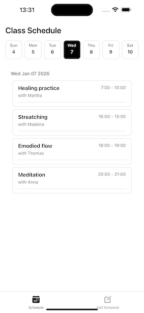
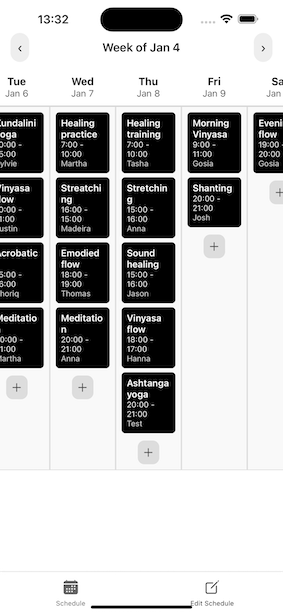
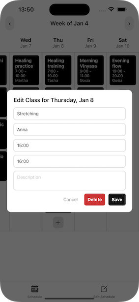
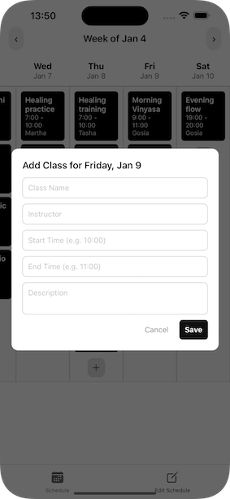

# Class Schedule and Admin Console Showcase

A demo showcase demonstrating how to build a Class Schedule page in React Native with an Admin console connected to a REST API. The app shows how to update, delete, or add classes using Firebase Realtime Database as the backend.

## Features

- **View Schedule**: Browse classes by date with a swipeable day/week picker
- **Admin Console**: Add, edit, and delete classes
- **Firebase Integration**: Real-time updates via Firebase Realtime Database REST API
- **Auto-login**: Automatic authentication on app start


## Project Structure

```
├── App.js                          # Auto-login and navigation
├── screens/
│   ├── Home/ClassSchedule.tsx      # View classes
│   └── Admin/EditScheduleWeekly.tsx # Edit classes
├── components/ClassScheduleCard.tsx
├── hooks/useClasses.ts
├── types/class.ts
└── util/
    ├── auth.js                     # Firebase authentication
    └── http.js                     # REST API calls
```

## Tech Stack

- React Native (Expo)
- Firebase (Authentication & Realtime Database)
- React Navigation
- TypeScript


Here’s how the app looks:

Class Schedule page:




Admin Console:





Edit Class:





Add Class:



